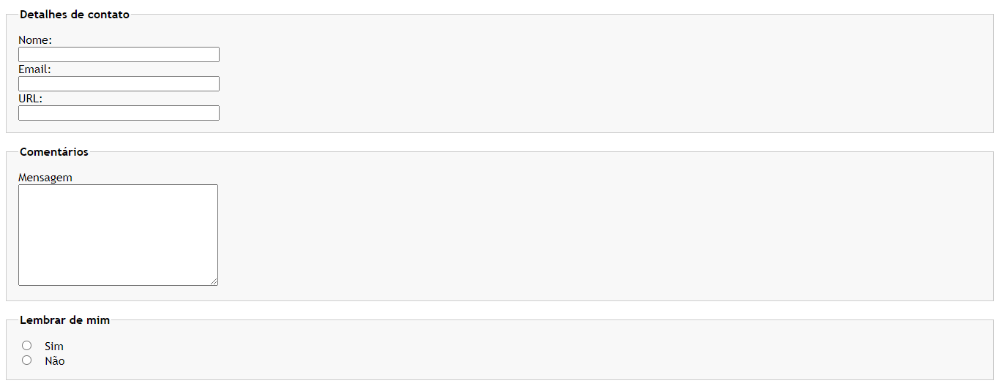

# Componente 4: Formulário estilizado 1

Formulário estilizado usando HTML e CSS, atividade proposta para a seção CSS intermediário/avançado do curso de Desenvolvimento Web do professor Jamilton Damasceno.

 